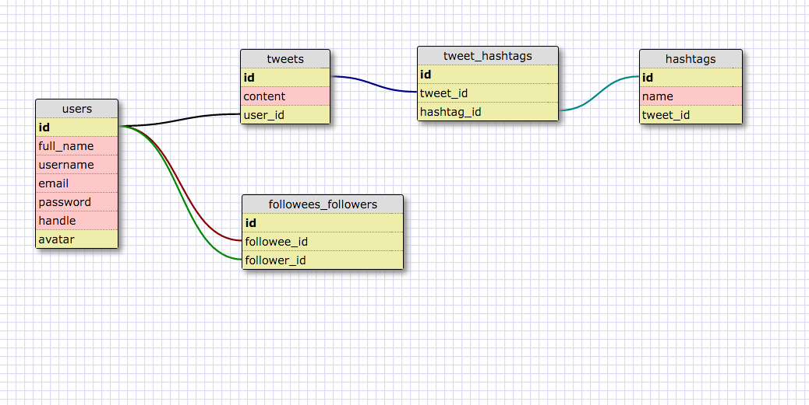
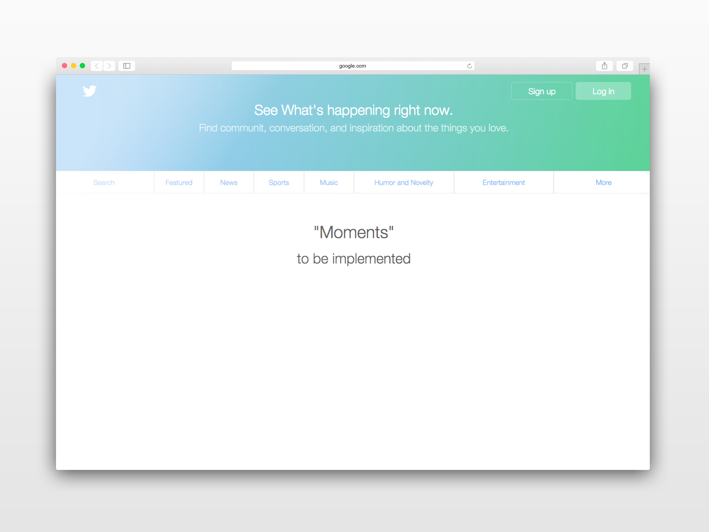
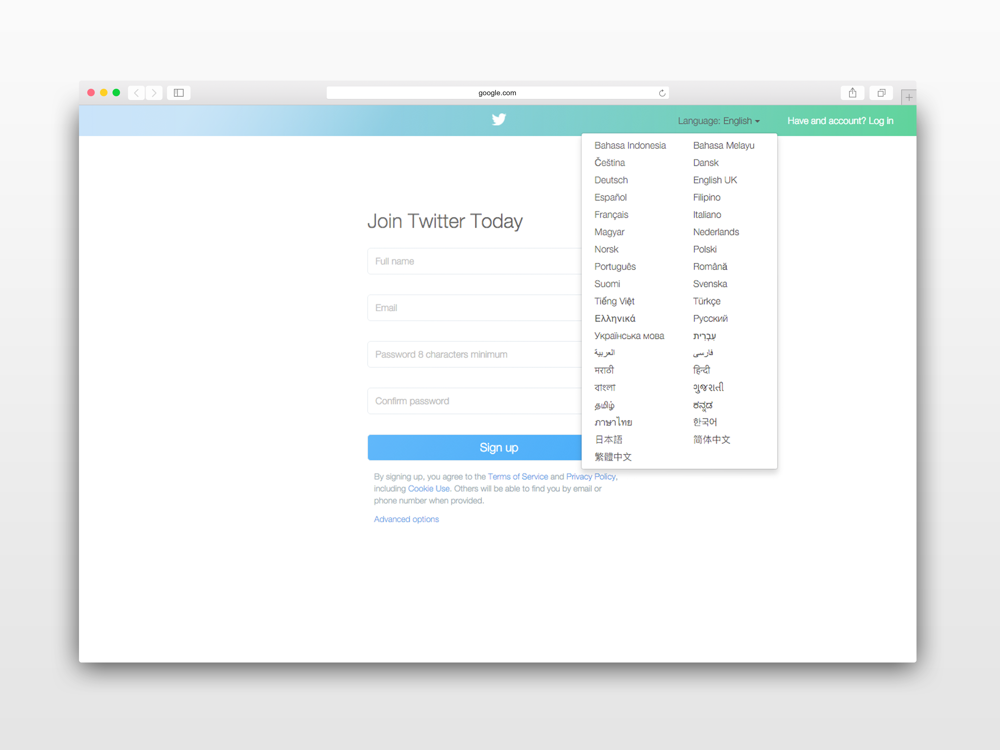
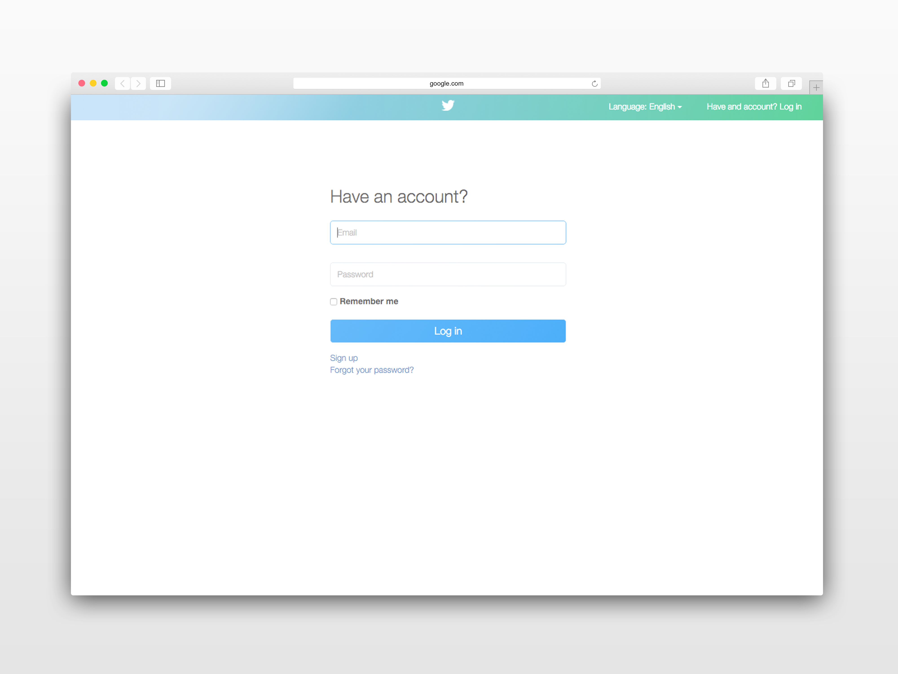
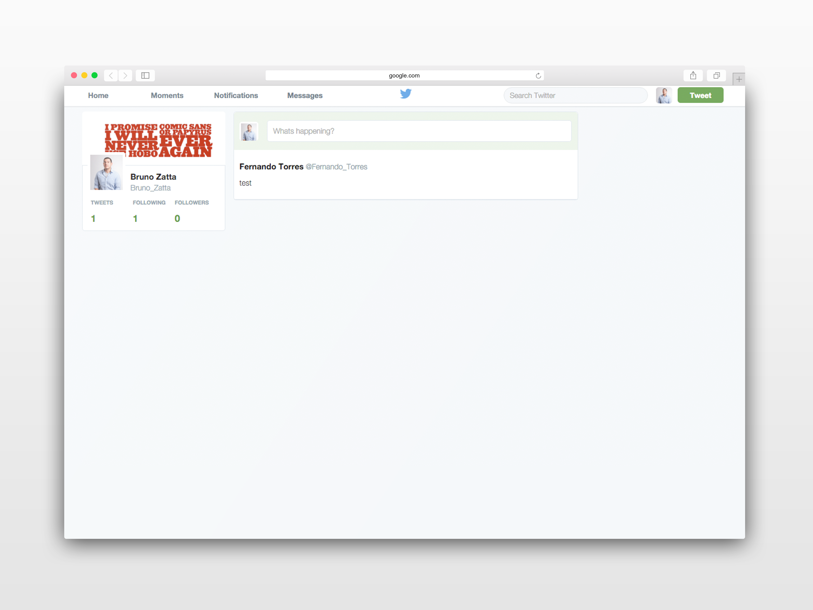
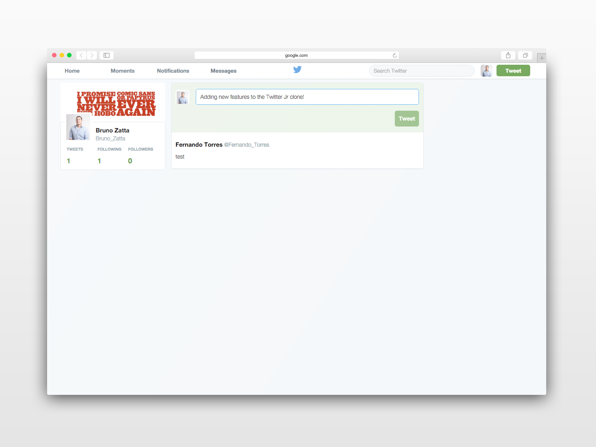

# Twitter JR

A study of technologies, database relationships, and UX design choices of popular websites and applications.

##Description

Twitter JR is the second of a series of webpage clones and highlights some of the core functionality of the popular Twitter application. Currently the app supports account registration, adding tweets, and following other users.

## Technologies

* Ruby
* Rails
* JavaScript
* jQuery
* PostgreSQL
* Bootstrap

##Next steps 

The app handles basic crud for retrieving posting and up/down voting. I’m currently working on building authentication on the client side including storing tokens in local storage, persisting login, and handling logouts. 

